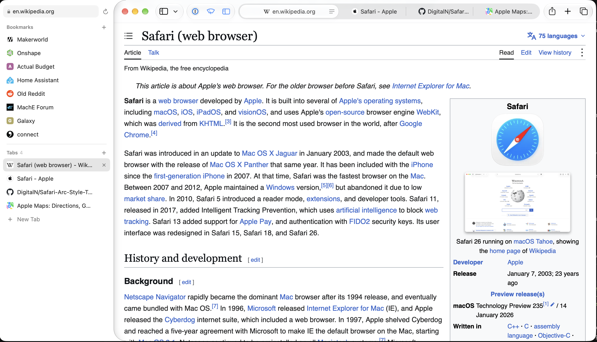

# Side Tabs for Safari

Arc-style vertical tabs for Safari on the Mac. A sidebar sits against the left edge of
your Safari window and lists that window's tabs, each with its icon and title, with your
favorite sites pinned at the top.



**[⬇︎ Download the latest version](https://github.com/DigitalN/Safari-Arc-Style-Tabs/releases/latest)**
(free, for macOS 26 or later)

## Install

1. **Download** `Side-Tabs-….dmg` from the
   [latest release](https://github.com/DigitalN/Safari-Arc-Style-Tabs/releases/latest)
   and open it.
2. **Drag Side Tabs into Applications**, as the arrow shows.
3. **Open Side Tabs** from Applications. It walks you through the rest of setup.

The first time you open it, macOS may say it can't verify Side Tabs. Click **Done**, then
go to **System Settings → Privacy & Security**, scroll down, and click **Open Anyway**. You
only do this once. It's needed because Side Tabs is free and isn't distributed through
Apple, so Apple hasn't checked it; all of its code is on this page.

## Features

- **Tabs**: click to switch, ✕ or middle-click to close, right-click for more.
- **Bookmarks**: favorite sites pinned at the top. A dot marks the ones already open.
- **Drag to reorder** tabs and bookmarks. Drag a tab into Bookmarks to save it.
- **Rename tabs**: double-click a tab to give it your own name.
- **Address bar**: shows the current site. Click it to type a new address or search.
- **Stays out of the way**: follows Safari's window and makes room for itself. In full
  screen, move the pointer to the left edge to slide it out.

Show or hide the sidebar with the Side Tabs button in Safari's toolbar. Settings are in the
menu bar icon.

## Troubleshooting

- **macOS won't open Side Tabs.** Go to System Settings → Privacy & Security, scroll
  down, and click **Open Anyway** (see Install). If macOS says the app *is damaged*, open
  Terminal, paste the command below, and press Return:
  ```bash
  xattr -dr com.apple.quarantine "/Applications/Side Tabs.app"
  ```
- **Side Tabs asks to move itself to Applications.** Click **Move to Applications**.
  Side Tabs has to run from your Applications folder: opened from the disk image or
  Downloads, Safari can't find its extension.
- **The sidebar doesn't appear.** Open System Settings → Privacy & Security → *Device
  Control and Data Access* (*Accessibility* on macOS 26). If Side Tabs is listed, select
  it and click **−**, then click **+** and choose Side Tabs from Applications. macOS
  sometimes keeps an old entry after an update. Side Tabs restarts itself once access
  works.
- **Side Tabs isn't in Safari's Extensions list.** Make sure Side Tabs is in Applications
  and has been opened once, then quit and reopen Safari.
- **Safari turns the extension off whenever it restarts.** In Safari → Settings →
  Advanced, turn on *Show features for web developers*. Then, in the new Developer tab,
  turn on *Allow unsigned extensions*. You'll have to redo this after each Safari restart.
  Please also [open an issue](https://github.com/DigitalN/Safari-Arc-Style-Tabs/issues) so
  it can be fixed properly.
- **Tab names and icons are missing.** Allow the extension on every website (setup step 3).
- **The sidebar says "Connecting to Safari…".** That's normal for a few seconds after
  Safari or Side Tabs starts.
